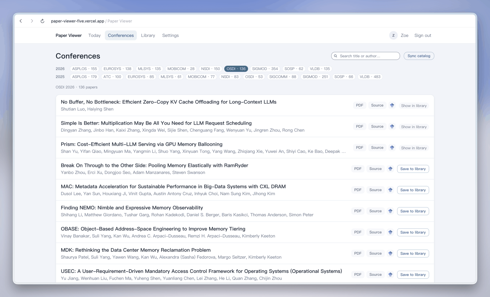

# csconf-papers

Accepted-paper lists for 11 systems and database conferences, rebuilt from DBLP on the first of every month.

Each cell links to the readable listing for that edition. An em dash means no data yet, which is not the same as zero papers accepted.

| Year | SOSP | OSDI | ATC | NSDI | EuroSys | ASPLOS | SIGMOD | VLDB | SIGCOMM | MobiCom | MLSys |
|---|---|---|---|---|---|---|---|---|---|---|---|
| 2025 | [66](papers/2025/SOSP.md) | [53](papers/2025/OSDI.md) | [100](papers/2025/ATC.md) | [83](papers/2025/NSDI.md) | [85](papers/2025/EuroSys.md) | [179](papers/2025/ASPLOS.md) | [251](papers/2025/SIGMOD.md) | [483](papers/2025/VLDB.md) | [88](papers/2025/SIGCOMM.md) | [77](papers/2025/MobiCom.md) | [61](papers/2025/MLSys.md) |
| 2026 | [62](papers/2026/SOSP.md) | [136](papers/2026/OSDI.md) | — | [150](papers/2026/NSDI.md) | [138](papers/2026/EuroSys.md) | [155](papers/2026/ASPLOS.md) | [354](papers/2026/SIGMOD.md) | [185](papers/2026/VLDB.md) | — | [28](papers/2026/MobiCom.md) | [135](papers/2026/MLSys.md) |

Last updated: 2026-09-01

## Read these lists in a reader

[paper-viewer](https://github.com/tshi92/paper-viewer) syncs this catalog and renders the papers inline for reading and annotation. It discovers new venues through `data/index.json`, so an edition added here shows up there on the next sync without any change on its side.



## Layout

| Path | Contents |
|---|---|
| `data/{year}/{VENUE}.json` | The data, and the source of truth |
| `data/index.json` | Which of those files exist, with a count and a checksum for each |
| `papers/{year}/{VENUE}.md` | The same list, readable |
| `venues.yaml` | The only file maintained by hand: how each venue maps to DBLP |
| `data/*-cache.json` | Lookup results, so a monthly run re-asks about new papers only |

## Fields

| Field | Meaning |
|---|---|
| `title`, `authors`, `year`, `venue` | The paper |
| `name` / `display_name` | DBLP's canonical author name, and the same name without its homonym suffix |
| `pid`, `orcid` | Author identity |
| `doi`, `url` | The paper's page at the publisher |
| `url_source` | Set when the link was matched in rather than supplied by the source |
| `pdf_url`, `pdf_source` | A PDF, and how its address was arrived at |
| `arxiv_id` | The arXiv preprint, where one exists |

### Author names

DBLP appends a four-digit suffix to tell apart different people who share a name — `Li Jiang 0002` is the second Li Jiang, with pid `45/4954-2`. Roughly a fifth of the author entries here carry one.

**Use `display_name` to display, and `name` or `pid` for identity.** Dropping the suffix before matching would merge two real people.

## Where the links come from

**Paper links** come from DBLP. For an edition DBLP has not indexed yet, the list is scraped from the conference site instead — those pages carry no links at all — and missing links are matched by title against Semantic Scholar, usually landing on the authors' own arXiv preprint. Matched links are marked with their host in the listings and with `url_source` in the JSON. A paper with no link anywhere falls back to a Google Scholar search URL, which is constructed, never fetched.

**PDF links** are derived from the link each paper already has:

| `pdf_source` | Derived from | Fetchable by a script |
|---|---|---|
| `source` | the DBLP link already was a PDF (PVLDB) | yes |
| `usenix-derived` | a USENIX presentation URL, checked with HEAD before publishing | yes |
| `publisher-doi` | an ACM DOI | no — `dl.acm.org` answers automated requests with 403 |
| `arxiv-derived` | a matched arXiv abstract page | yes |

All of them are free to read: the ACM Digital Library is open access, and the 403 above is bot protection, not a paywall. The distinction matters only to software fetching on a reader's behalf.

**Preprints.** Where a paper with a DOI also has an arXiv preprint, its id is stored as `arxiv_id` and linked as `preprint`. The mapping is keyed by DOI, so it is exact rather than matched on a title. A preprint is not the version of record and can differ from the camera-ready, so it appears beside the official link, never in place of it.

## How it stays current

A GitHub Action re-syncs on the first of each month. Three guards keep a bad run from destroying good data:

- a write that would **reduce** an edition's paper count is rejected unless a human passes `--allow-shrink`
- an edition marked `indexed` that returns nothing fails loudly, because that means its DBLP key changed
- README counts are read from the files on disk, never from the run, so a failed fetch cannot empty a cell that still has data behind it

## Coverage

Editions appear as their publishers release them. Some are still filling up rather than incomplete: PVLDB publishes a volume across monthly issues, ASPLOS across several volumes per year, and an edition DBLP has not indexed is carried from the conference site until it is.

## Reading this from a script

Fetch a file from `raw.githubusercontent.com/RealZST/csconf-papers/main/{path}`. That serves a file by path and cannot be asked what a directory holds, so there is no way to discover a venue added since you last looked — which is what `data/index.json` is for. Fetch it first, then fetch the paths it names.

```json
{
  "schema": 1,
  "generated": "2026-08-20",
  "paper_count": 2819,
  "files": [
    {
      "path": "data/2025/ASPLOS.json",
      "venue": "ASPLOS",
      "year": 2025,
      "paper_count": 179,
      "updated": "2026-08-12",
      "sha256": "…"
    }
  ]
}
```

It is rebuilt from the files on disk by every command that writes one, so it describes what is published rather than what a run meant to publish. What that buys you:

- **`paper_count`** is the number of papers in that file. Check it against what you parsed. A truncated or partial import is otherwise indistinguishable from a small conference.
- **`sha256`** is over the exact bytes served for that path, so you can skip files that have not changed since your last run — typically all but one or two of them.
- **`venue`** is the filename spelling, which is also `meta.venue` and the venue's own: `EuroSys`, `MobiCom`, `MLSys`. It is one string that is never transformed, so there is no mapping to build. Normalise it for lookup if you must, but keep this form to display.

Two things it does not promise. **`updated` is not a content checksum**: it records when the list was collected from DBLP, and filling in links refetches nothing, so links and PDF URLs can be added to a file without that date moving. Use `sha256` to detect a change. And a venue whose sync failed keeps its previous count and checksum, so the index always agrees with this repository but may lag the publisher until the next run.

## Sources

Metadata from [DBLP](https://dblp.org). Preprint and link matching via the [Semantic Scholar](https://www.semanticscholar.org/product/api) Academic Graph API. Conference sites are used only for editions DBLP has not indexed yet.

